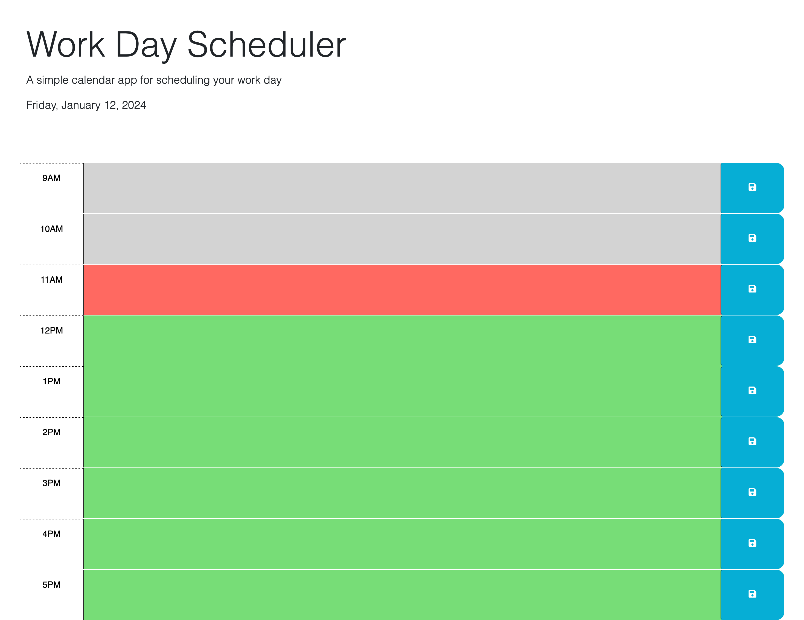

# JS-Todo-List
I'm using 3rd party API's to finish the code for a to-do list in my bootcamp assignment!

A straightforward application created using initial code to assist users in monitoring their daily tasks. It monitors the present hour, distinguishing sections with different colors for past, present, and future hours, aiding in deadline management. Additionally, the app locally preserves task data, ensuring persistence upon reopening or refreshing the page. Its development served as an opportunity to practice incorporating dayjs and jQuery for effective DOM manipulation.

## Usage
This project can be used as a daily todo list for you busy schedule. After inputting your data and saving it, you will be able to check the console and revisit your errands for the day.

## Link

[This link brings you to the deployed project](https://jtwiley1996.github.io/JS-Todo-List-/)

# Credits

For this project, I used APIs JQuery and DayJS in my JS code. I also used HTML/CSS starter code from my UW Bootcamp for the framework of the project.
I used stack overflow and youtube for assistance in coding my JS/Jquery/Dayjs.